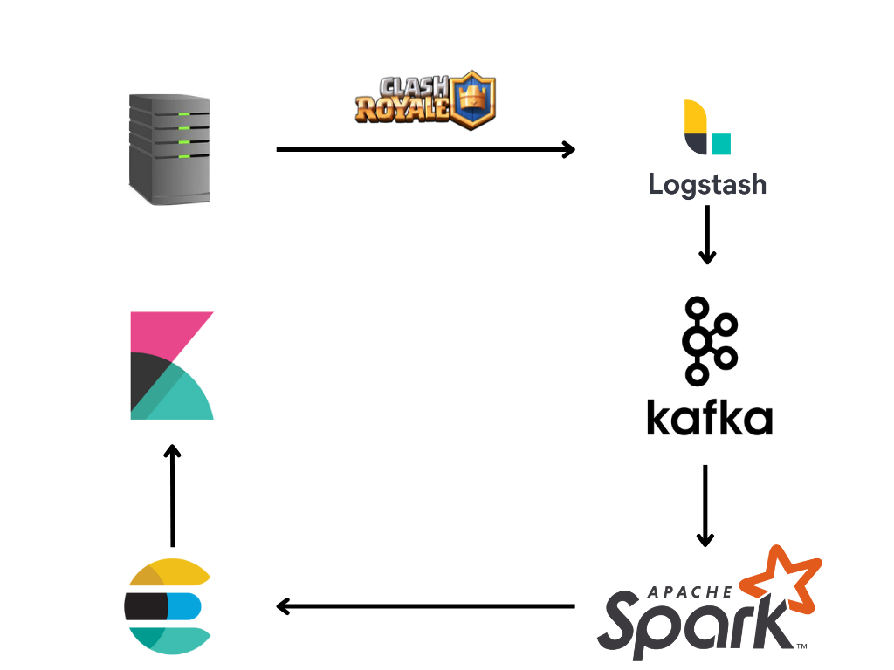

# Classificatore Clash Royale
Lo scopo di questo progetto è quello di creare un classificatore real-time che sia in grado di classificare i match di clash royale indicando se il match è stato interessante o non interessante.

## PipeLine

## Utilizzo
Per provare il progetto basta scaricare la repo e eseguire 
> docker-compose up

## Link Utilizzabili
|Servizio|URL| 
|:---:|---:|
|Simulatore chiaate API| http://localhost:8000/return-log|
|ElasticSearch|http://localhost:9200|
|Kibana|http://localhost:5601|

## Avvertimenti 
All'interno della repository vi sono presenti pure i file CSV utilizzati per il training del modello di classificazione, per la simulazione delle chiamate API e altri per eventuali prove.
Per questo motivo la repository potrebbe essere pesante da scaricare, impiegherete un pò di tempo 🤗.
